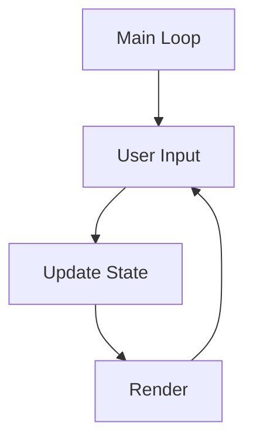

# Cpp_15Puzzle
C++ 15 Puzzle  Implementation

# Steps to Build the project

1) Clone the project with `git clone git@github.com:Red-Sage/Cpp_15Puzzle.git`.
2) Make a build directory and cd to it with `mkdir build && cd build`.
3) Run cmake with `cmake ../`.
4) Build the project with `cmake --build .`.

# Game Loop

# The Game Board
The game board is a class that represent the state of the game and the game logic.
The board itself is represented by a vector of integers. The integers are 
required to start at 1 and end at a perfect square. That is, the game board
must be square. This is enforced by in the class.

# Screen
This project uses ncurses to provide an interactive terminal for the game. The
project uses the namespace `Screen` to house the rendering functions.

# Game Play
The game is played by moving the blank space around the game board using the
arrow keys. Pressing the `q` key at any time will exit the game. When the game
is over the user is given a chance to play again or quit.

https://user-images.githubusercontent.com/100734923/226125673-bdf0c10b-a3f6-4c82-84e1-ed5ad2122540.mp4

